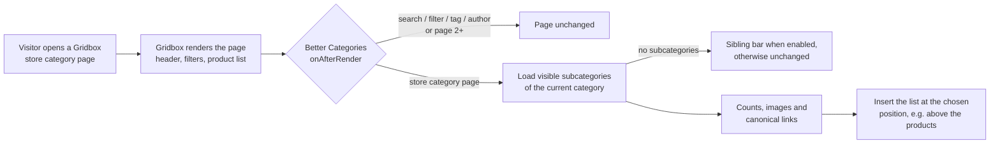

# Better Categories for Balbooa Gridbox (Joomla 6 Package)

[-orange?style=for-the-badge)](https://www.balbooa.com/joomla-gridbox)

A native Joomla 6 extension that makes **Balbooa Gridbox store categories** navigable the way shoppers expect: a parent category **shows its subcategories first** (as text links or image tiles, with product counts), and the products below — which shoppers can **filter by price, product fields, technical parameters and features** read from the descriptions.

Out of the box, a Gridbox store category page lists the products of the **whole category subtree**. A visitor who opens *Meters* immediately gets a mixed grid of every meter from every subcategory, with no way to pick *Installation testers* or *Thermal cameras* first. Better Categories adds that missing level of navigation — without touching Gridbox, its templates or its product list.

---

## ⚡ Key Highlights & Capabilities

* **Subcategories on every store category page:** On the store home page and on each category with children, the plugin lists the **direct subcategories of the current category**. Leaf categories (no children) are left exactly as Gridbox renders them.
* **Product counts that match Gridbox:** Each subcategory shows the number of products in it **and all of its subcategories** — counted the same way as Gridbox's own *Categories* element: published and currently live products the visitor is allowed to see, primary category plus Gridbox's *additional categories* map, without the subscription add-ons Gridbox hides from listings.
* **Canonical links:** Subcategory links use the same menu item (`Itemid`) Gridbox itself would pick — the category's menu item, the nearest parent's, the store app's, or the Gridbox home page — so they resolve to the same canonical URLs as Gridbox's sitemap, e.g. `/oferta/meters/installation-testers`.
* **Text links or image tiles:** A simple list of links, one under another or in one wrapping row — or tiles with images in four styles: *text below the image*, *card*, *text on the image with a gradient* and *cover*.
* **What is inside each category (new in 1.1.0):** Every category can show its own subcategories — as text under the name, a **drawer sliding down** that pushes the layout, a **panel sliding in from the side**, a **card flip** with the list on the back, or a **modern tooltip**. Custom title (e.g. *In this category:*), list / inline / chip styles, a limit with a *+N more* link, product counts, colours, hover or button opening, and a separate mode for phones.
* **Fewer categories than columns (new in 1.1.0):** Six columns but only three subcategories? Keep them on the left, centre them, or stretch them over the full width of the module — per device.
* **Fast WebP thumbnails (new in 1.2.0):** Tiles load small WebP copies of the images (tile width and twice that for sharp screens) instead of full-size photos — made once, kept on the server, EXIF rotation and transparency preserved.
* **Per-level settings (new in 1.2.0):** Large image tiles on the store home page, compact text links deeper down — heading, display, tile style, direction, columns and the *what is inside* mode can differ per level of the tree.
* **Sibling bar on the last level (new in 1.2.0):** A category without subcategories shows the categories next to it (current one highlighted) and a link back to the parent, so shoppers switch without going back. It scrolls sideways on phones.
* **Structured data (new in 1.2.0):** The listed categories as a schema.org `ItemList`, and a `BreadcrumbList` (store → parents → current category) that is added only when the page has none of its own.
* **Lowest price on every category (new in 1.3.0):** “from 1 290 zł” under each category — the lowest price in its subtree, taking sale prices, store sales and product variations into account, in the store currency (also the one picked in Gridbox's currency switcher).
* **A module for any page (new in 1.3.0):** `mod_bettercategories` shows the list of any store category — or the store home — in a module position or a Gridbox *Joomla Module* element, e.g. on the home page, with the plugin's styles and its own overrides.
* **Faster first view (new in 1.3.0):** thumbnails can be generated for the whole store with one click, and the first row of tiles loads with high priority (better LCP in PageSpeed).
* **Settings file (new in 1.3.0):** export all settings or only the styles to a JSON file and import them on another site.
* **6 administrator languages:** English (default), German, Polish, French, Czech and Dutch. The language follows the Joomla administrator language; for other languages the texts are in English. Right-to-left sites get a mirrored list: side panels, toggle buttons and the back arrow follow the writing direction.
* **Product filters (new in 1.5.0):** price, Gridbox list fields, **technical parameters read from the product descriptions** (1000 V = 1 kV, CAT IV, IP67, from–to ranges) and **features** found in them (*Bluetooth*, *True RMS*), on sale, in stock — in a side bar, one row above the products, a side panel behind a *Filters* button or next to any Gridbox element; a side panel on phones. Counts at every option, chips of the chosen filters, instant results without reloading, linkable addresses, `noindex` for filtered lists. Off by default. See [Filters](#filters).
* **Reset to defaults (new in 1.5.0):** one button brings back the settings of a fresh installation, keeping this site's store IDs and filters if you wish.
* **Help tooltips (new in 1.4.1):** a “?” beside every option shows its description on hover, keyboard focus or a click.
* **Prices exactly as Gridbox calculates them (1.4.0):** the first store sale that applies, category sales on the product's own category and its parents, automatic exchange rates and the language currency.
* **Smart category images:** Tile images come from, in order: an image chosen for the category in the plugin → the image set on the category in Gridbox → **the image of the most viewed product** in the category and its subcategories. Categories need no manual work to look good.
* **Modern hover effects:** Zoom in, zoom out, lift with shadow, light shine, grayscale-to-colour, tint fade-in / fade-out, tilt, outline ring — or none.
* **Full visual control:** Position on the page, alignment, direction, responsive columns (desktop / tablet / phone), font sizes and colours (empty = Gridbox theme), image shape (rectangle, rounded corners, circle), aspect ratio, fit, background, colour tint, drop shadow (angle, distance, blur, size, opacity) and spacing.
* **Zero impact on search and Gridbox's own filters:** Search results, Gridbox *Items filter* queries (`?query=`), tag and author listings are never modified; by default the list of subcategories appears only on the first page of a category.
* **Administrator menu entry:** *Better Categories for Gridbox* appears in the Joomla 6 administrator menu and opens the plugin settings directly.
* **Joomla 6 & PHP 8.5 native:** Service-provider plugin with lazy loading, `createQuery()`, dependency-injected database, no deprecated Joomla APIs in the extension code, no warnings on PHP 8.5.

---

## 🛠️ How It Works

```mermaid
flowchart LR
    A[Visitor opens a Gridbox<br/>store category page] --> B[Gridbox renders the page<br/>header, filters, product list]
    B --> C{Better Categories<br/>onAfterRender}
    C -->|search / filter / tag / author<br/>or page 2+| G[Page unchanged]
    C -->|store category page| D[Load visible subcategories<br/>of the current category]
    D -->|no subcategories| H[Sibling bar when enabled,<br/>otherwise unchanged]
    D --> E[Counts, images and<br/>canonical links]
    E --> F[Insert the list at the chosen<br/>position, e.g. above the products]
```

1. The system plugin runs after Gridbox has rendered the page (`onAfterRender`), only on the site, only for `com_gridbox` category views (`view=blog`) of **store apps** (or the apps you list).
2. It reads the published categories of the app the visitor may see (access level, language), drops branches under unpublished or hidden parents and finds the children of the current category (the store home page is category `0`).
3. It counts products per subtree, picks tile images and builds links with Gridbox's own `Itemid` rules, then routes them through Joomla's router (and therefore Gridbox's router).
4. The block — a `<nav>` with its own scoped `<style>` — is inserted next to a Gridbox element of the category template: by default **right before the product list** (`.ba-item-blog-posts`). If the chosen anchor is not on the page, it falls back to *above the products*; if there is no product list at all, nothing is inserted.

**Filters (1.5.0)** run a step earlier, at the start of Gridbox's own page processing (`onBeforeRenderGridbox`): the plugin finds the products of the category subtree exactly as Gridbox lists them, applies the filters from the address and renders Gridbox's product list again **with Gridbox's own helpers and templates** for the matching products only — same cards, sorting, page size and pagination — so Gridbox still adds lazy loading and adaptive images to it.

Nothing is written to the database and Gridbox files are not modified; the only files the plugin creates are the image thumbnails in `media/plg_system_bettercategories/thumbs` (and its cache entries). Disabling the plugin restores the original pages instantly.

---

## 🚀 Installation & Package Structure

1. Download `pkg_bettercategories-1.6.0.zip` from [Releases](https://github.com/merserwis/plg_system_bettercategories/releases).
2. In the Joomla administrator go to **System → Install → Extensions** and upload the package.
3. On a fresh install the plugin is **enabled automatically**; an update keeps whatever you chose before. If Balbooa Gridbox is not installed, the installer says so in a notice.
4. Open **Better Categories for Gridbox** in the administrator menu (or *System → Plugins → System - Better Categories for Gridbox*) and adjust the settings.

| Extension | Type | Purpose |
|---|---|---|
| `plg_system_bettercategories` | System plugin | Renders the subcategory list on Gridbox store category pages. |
| `com_bettercategories` | Administrator component | Menu entry *Better Categories for Gridbox* that opens the plugin settings. |
| `mod_bettercategories` | Site module | The list of any store category in a module position or a Gridbox *Joomla Module* element. |
| `pkg_bettercategories` | Package | Installs and updates all three in one step. |

Uninstalling the package removes all three extensions and the thumbnails; the plugin stores nothing else outside its own settings.

**Updates:** the package registers the update server `https://raw.githubusercontent.com/merserwis/plg_system_bettercategories/main/update.xml`, so new releases appear in *System → Update → Extensions*. Joomla verifies each download against the SHA-256 checksum in `update.xml`.

---

## 👀 Live Preview

The *Layout*, *Text and colours* and *Tiles* tabs have a **live preview column**. It shows the list exactly as the plugin renders it — real categories, counts and images from your store — using the values currently in the form, before you save. Switch between **Desktop (1280 px), Tablet (820 px) and Phone (390 px)**: the preview renders at the real device width, scaled to fit, so column settings and all responsive rules apply as on the site. Pick any parent category to preview its subcategories. Sliders show their current value, and colour pickers are enlarged for easier use.

---

## ⚙️ Configuration Reference

Empty typography and colour fields always mean **"use the Gridbox theme value"**.

### Settings

| Option | Default | Description |
|---|---|---|
| Gridbox app IDs | *(empty)* | Comma-separated IDs of the Gridbox apps to handle. Empty = every store (*Products*) app. |
| List heading | `Categories` | Heading above the list. Empty = no heading. |
| Heading tag | `H2` | `H2`, `H3`, `H4` or `DIV`. |
| Show product count | Yes | Shows `(n)` after each subcategory — products in the subcategory and all of its subcategories. |
| Count on last-level categories only | No | With the count enabled: show `(n)` only on categories without subcategories — the last level, where the products are. |
| Hide products until the last category | No | On the store home page and on categories that have subcategories, hide the Gridbox product list so visitors pick a category first; products appear on the last level. Search results are not affected. |
| Also hide product filters | No | Hide the Gridbox product filters on the same pages. |
| Hide subcategories without products | Yes | Skips subcategories whose count is 0 (e.g. *Uncategorised*). |
| First page of the list only | Yes | No list on `?page=2` and further. |
| Settings file | — | **Export all settings**, **Export styles only** (without store IDs, element IDs, category images and filters, so the file fits another site), **Import from file…** and **Reset to defaults**. Export takes the values currently in the form. Import checks the file, takes only known settings (plain values, nothing else), saves them at once and reloads the page; *Import styles only* keeps this site's store IDs, element IDs, category images and filters. Reset gives every setting the value of a fresh installation and saves it at once; with the tick box (on by default) this site's store IDs, element IDs, category images and filters stay. |
| Cache time (minutes) | `15` | The finished list is stored and reused (per category, device, language, access level and currency), so pages are not slowed down. `0` = no cache. Saving the settings clears it, together with Joomla's and Gridbox's page caches. A store sale starting or ending, or a product being published or ending on schedule, gives a fresh list at once. Expired entries are removed once an hour. |

### Layout

| Option | Default | Description |
|---|---|---|
| Position on the page | Above the product list | *Above / below the product list*, *below the category header*, *at the start of the page content*, *before / after a chosen Gridbox element*. Falls back to *above the product list* when the anchor is missing. |
| Gridbox element ID | *(empty)* | For the *before / after element* positions: the `id` of an element in the category template, e.g. `item-1500368728` (see the page source). |
| Show categories as | Text (links) | *Text (links)* or *Tiles with an image*. |
| List direction | Row by row | *Row by row* (left → right, then the next row), *Column by column* (top → bottom, then the next column), *One scrolling row* (swiped sideways) or *Inline, wrapping* (text links). |
| Text alignment | Left | Left, centre or right (in right-to-left languages Left is the start of the line) — heading, links and tile captions. |
| Columns | `0` | `0` = automatic: 1 column of text, 4 tiles per row. For horizontal tiles: how many tiles fit the width. |
| Columns — tablet (≤ 1024 px) | `0` | `0` = same as desktop. |
| Columns — phone (≤ 768 px) | `0` | `0` = same as tablet. |
| Space above / below the list (px) | `0` / `24` | Outer margins of the block. |
| Side margin — desktop and tablet / phone (px) | `0` / `16` | Left and right space, so tiles do not touch the screen edges on phones. |
| Gap between items (px) | `16` | Space between links / tiles. |
| When there are fewer items than columns | Align left | *Align left*, *Centre* (items keep the width they have in a full row) or *Stretch to full width* (items share the whole width of the module). Applies to every direction and device. |
| Heading space above / below (px) | `0` / `16` | Margins of the heading. |

Column counts work even on sites that strip `@media` rules from the HTML served to phones: the plugin also detects phones and tablets from the browser's User-Agent and uses the matching count directly, while explicit `@media` ranges keep a cached page correct on every device.

### Text and colours

| Option | Default | Description |
|---|---|---|
| Font size | *(theme)* | E.g. `16px`, `1rem`, `1.2em`; a bare number means pixels. |
| Heading font size | *(theme)* | Same format. |
| Font size — phone / Heading font size — phone | *(desktop value)* | Separate sizes for phones (≤ 768 px). |
| Text colour | *(theme)* | Heading, counts and texts. |
| Link colour | *(theme)* | Category names. |
| Link hover colour | *(theme)* | Also the colour of the *Outline* hover effect. |
| Show the lowest price | No | Under each category: the lowest price of its products, including subcategories — the sale price when set, otherwise the price after an active store sale, over all product variations; products without a price are left out. Shown in the store currency with its separators, decimals and symbol position; the currency picked in Gridbox's currency switcher is respected (cached separately). |
| Price text | `from %s` | `%s` = the price with the currency, e.g. `from %s net`. |
| Price colour | *(text colour)* | |

### Tiles

| Option | Default | Description |
|---|---|---|
| Tile style | Text below the image | *Text below the image*, *Card* (border and shadow), *Text on the image with a gradient*, *Cover* (image fills the tile, centred text over a tint). |
| Gradient / tint colour | `#000000` | Colour of the gradient (*Text on the image*) or tint (*Cover*). |
| Image shape | Rounded corners | Rectangle, rounded corners or circle. |
| Corner radius (px) | `12` | For rounded corners. |
| Image aspect ratio | `1:1` | `1:1`, `4:3`, `3:2`, `16:9`, `3:4`. A circle is always `1:1`. |
| Text distance from the image — top / bottom (px) | `10` / `0` | Spacing of the caption in the *Text below the image* and *Card* styles. |
| Background under the image | `#ffffff` | Shown under transparent PNGs and around images with the *Contain* fit. |
| Image fit | Contain | *Contain* = the whole image is visible (best for product photos on white). *Cover* = cropped to the shape. |
| Image tint colour / Tint opacity (%) | *(none)* / `0` | A colour layer over the image, under the text. |
| Mouse hover effect | Zoom in | See the table below. |
| Shadow under the image | No | Enables the drop shadow. |
| Shadow colour | `#000000` | |
| Shadow angle (°) | `90` | Direction the shadow falls: 0° = right, 90° = down, 180° = left, 270° = up. |
| Shadow distance (px) | `8` | |
| Intensity — blur (px) | `20` | Higher = softer, wider shadow. |
| Shadow size (px) | `0` | Grows (+) or shrinks (−) the shadow relative to the image. |
| Shadow opacity (%) | `20` | |
| Use the Gridbox category image | Yes | Use the image set on the category in Gridbox when the plugin has none for it. |
| Most popular product image | Yes | Otherwise use the image of the most viewed visible product in the category and its subcategories. |
| Fast thumbnails (WebP) | Yes | Small WebP copies instead of full-size photos: one at the thumbnail width, one twice as wide for sharp screens (`srcset`). Made once, kept in `media/plg_system_bettercategories/thumbs`; a changed image gets new copies. External images, images not larger than the tile and servers without WebP support in PHP GD keep the original image. |
| Thumbnail width (px) / quality | `480` / `80` | Width of the smaller copy (160–1600) and WebP quality (40–95). |
| Thumbnails — tools | — | **Generate thumbnails now** makes the copies for every category of the store at once (in steps, with progress), so no visitor waits for them; **Delete thumbnails** removes them all and clears the cache. |
| Load the first row at once | Yes | Images of the first row of tiles (as many as the columns on the visitor's device) load immediately with `fetchpriority="high"`, the rest lazily. Not in the module, which may sit lower on the page. |
| Own category images | *(empty)* | Pick a category and an image from Media — takes priority over every other source. |

### Subcategories

| Option | Default | Description |
|---|---|---|
| Show what is inside | Do not show | *Text under the category name* (always visible), *Drawer sliding down* (opens under the category and pushes the layout down), *Panel sliding in from the side* (over the tile), *Card flip* (the tile turns over; the back lists the subcategories and a *View all* link), *Tooltip* (a bubble above the category). Side panel and card flip need tiles; text links use the drawer instead. |
| Open on | Mouse hover and button | Hover opens panels only on devices with a real mouse; touch screens and keyboards always use the **+** button (it turns into **×**). *Button only* disables hover. |
| On phones | Automatic | *Automatic* turns the card flip and side panel (too small on a narrow tile) into the drawer; *Same as desktop*; or a fixed mode for phones. Phones are recognised from the browser, like the phone column setting. |
| Title | `In this category:` | Shown above the list; empty = no title. |
| List style | One under another | *One under another*, *In one line, comma separated* or *Chips*. |
| Maximum subcategories | `6` | Longer lists end with a *+N more* link to the category. `0` = all. |
| Show product counts | No | Counts next to the subcategories, counted like the main list. |
| Panel background / text colour | `#ffffff` / *(theme)* | Colours of the drawer, side panel, card back and tooltip. |
| “More” link text | `+%d more` | `%d` = the number of hidden subcategories. |
| “View all” link text | `View all` | Card back only. |
| Button label for screen readers | `Subcategories of %s` | `%s` = the category name. |

Only visible subcategories are listed (same access, publishing and language rules as the main list, empty ones hidden when *Hide empty categories* is on). Panels are keyboard accessible: the button has `aria-expanded` / `aria-controls`, **Escape** closes the panel and returns focus to the button, a click outside closes it, and opening one panel closes the others. The drawer under a narrow tile (under 200 px) opens across the whole row; the tooltip moves to stay inside the window and opens downwards when there is no room above.

### Module (mod_bettercategories)

Create it in *Content → Site Modules → New → Better Categories for Gridbox*, or add it to a Gridbox page with the **Joomla Module** element. It needs the Better Categories plugin enabled and uses all of its styles.

| Option | Description |
|---|---|
| Category | The category whose subcategories are listed, or *Store home* (the top categories). |
| Store app ID | For the store home only: which store; `0` = the store set in the plugin, or the first store. |
| Heading, display, tile style, direction, columns (desktop / tablet / phone), *what is inside*, lowest price | Left at *— plugin setting —* they follow the plugin. |

The module never hides products, adds no structured data and loads images lazily. It has its own cache entries (per module, device, language and currency).

### Per level

Rows of settings for one level of the category tree each: *Store home page*, *Level 1* (a top category), *Level 2* (its subcategory), *Level 3 and deeper*. Every field left at *— main setting —* keeps the value from the other tabs.

| Field | Overrides |
|---|---|
| List heading | The heading above the list. |
| Show categories as | Text links or tiles. |
| Tile style | Text below the image, card, text on the image, cover. |
| List direction | Rows, columns, one scrolling row, inline. |
| Columns / tablet / phone | Column counts per device. |
| Show what is inside | The subcategory panel mode. |

The live preview shows the level of the category chosen in it.

### Navigation and SEO

| Option | Default | Description |
|---|---|---|
| Sibling categories on the last level | No | A category without subcategories shows a bar of chips with the categories next to it — the current one highlighted (`aria-current="page"`) — and a link back to the parent. Products stay as Gridbox shows them. On phones the bar scrolls sideways with the current category in view. |
| Bar heading | `Related categories` | Empty = no heading. |
| Link back to the parent category / text | Yes / `Back to %s` | `%s` = the parent category (or the store on top-level categories). |
| Structured data: category list | Yes | The listed categories as a schema.org `ItemList` (JSON-LD). |
| Structured data: breadcrumbs | Automatic | A schema.org `BreadcrumbList`: store → parent categories → current category. *Automatic* adds it only when the page has no breadcrumb data of its own (e.g. from a breadcrumbs module), so there are never two; *Yes* always, *No* never. |

### Filters

Off by default. The panel appears on store category pages with at least *Minimum number of products* products (default 2); on a page whose list is hidden under the subcategories (*Hide products until the last category*) it appears once the list is shown.

| Option | Default | Description |
|---|---|---|
| Product filters | No | Switches the filters on. |
| Filters | *(empty)* | The filters, in the order shown. Empty list = **price** and **every list field** (select, radio, checkbox) of the store. |
| Panel position | Side bar on the left | *Side bar on the left / right* of the products (sticky while scrolling), *In the side column next to the products (top / bottom)* — the column beside the product list in the same Gridbox row (e.g. with the category tree or the contacts), found automatically, *Above the products* (one row, each filter opens as a menu), *“Filters” button* (a side panel), *After Gridbox's categories element* (e.g. in the page's side column), *Before / after a chosen Gridbox element* (by its id). A missing element puts the panel above the products. |
| On phones | “Filters” button | A button above the products opens the panel from the side, with *Show N products* to close it — also in desktop windows narrower than 768 px. *As on computers* keeps the chosen position. |
| Apply | At once | *At once*: every change shows the products without reloading the page. *With an “Apply” button*: the visitor chooses, then applies. |
| Number of products at the options | Yes | |
| Hide options without products | Yes | Options that would give no products with the filters already chosen are hidden; *No* shows them greyed out. |
| Options shown at first | `6` | More options behind *Show more*. `0` = all. |
| Minimum number of products | `2` | |
| Filtered pages: noindex | Yes | Filtered lists get `<meta name="robots" content="noindex, follow">`. |
| Side bar width, font size, accent, background and text colour | 260 px, 15 px, theme | Empty colours follow the Gridbox theme (`--primary` for the accent). |
| Texts on the site | *(empty)* | Panel title, button, *N products*, *Show N products*, *Clear all*, *Apply*, *No products…*, *Show more / less*, *From / To*, titles of the price, sale, stock and features filters. Empty = the text of the site language (English, German, Polish, French, Czech, Dutch). `%d` = the number of products. |

**Each filter:**

| Field | Description |
|---|---|
| Filter by | *Price*, *Gridbox field*, *Technical parameter (from the description)*, *Features (words in the description)*, *On sale*, *In stock*. |
| Title | Empty = automatic (the field label, or the name of the parameter in the site language). |
| Gridbox field | A list, radio, checkbox or text field of the store. |
| Parameter | Tick one or more (*Select all / Clear all*): voltage (V), current (A), power (W), apparent power (VA), frequency (Hz), resistance (Ω), capacitance (F), temperature (°C, °F converted), **pressure** (Pa, hPa, kPa, mbar, bar, psi — one parameter), **relative humidity** (%RH), **air velocity** (m/s), **flow** (m³/h, l/min), **concentration** (ppm), **irradiance** (W/m²), sound level (dB), illuminance (lx), energy (Wh), battery capacity (Ah), length (m), measurement category (CAT), protection rating (IP). Each ticked parameter is a filter of its own on the site, shown only in categories whose products have it. |
| Minimum products with the parameter | `2` — a parameter appears in a category when at least this many of its products have it. |
| Only in categories | The filter appears only in these categories and their subcategories (any filter type). Empty = everywhere. |
| Show as | *Values* — a tick box for each value found (`600 V`, `1000 V`, `2,5 kV`) — or *Range (from–to)*. Visitors may type prefixes in range fields: `2.5k`, `1M`. |
| Value of a product | A description names many values of one kind (a meter: a 30 V warning, 500 V, a 1000 V range). *Highest value* (default) counts each product with its highest — usually the measuring range —, *Lowest value* with its lowest, *Any value found* with each. |
| Features | One per line: `Name = word, other word`. A product has the feature when its title, introduction or description contains one of the words — whole words, any letter case, spaces and hyphens alike; `word*` also matches longer words. Without `=` the name itself is searched. |
| Several options chosen | *Any of them* (default; *all of them* for features). |
| Order of the options | As in Gridbox / the list, most products first, or alphabetical. |
| Name in the address | The filter's name in the address, `?f-name=…`. Empty = from the title. |
| Collapsed at first | The filter starts closed (it opens by itself while one of its options is chosen). |

**Addresses.** A filtered list has a readable address, e.g. `/shop/meters?f-producer=sonel,metrel&f-voltage=1000&f-price=100..500` — values joined with commas, ranges as `from..to` (either end may be empty). It can be linked and bookmarked, Gridbox's sorting and pagination keep it, and *Back* in the browser returns to the previous choice. Values that no longer exist in the address are ignored. Gridbox's own search, its *Items filter* (`?query=`), tag and author listings are left as they are.

**How products match.** Products are those Gridbox lists on the category page: the category and its subcategories, by primary category or Gridbox's additional categories, visible to the visitor. Prices are the lowest of the product and its variations after sale prices and store sales, in the currency shown; products without a price are not in a price filter. *In stock* means a stock left (or unlimited) on the product or one of its variations. Within one filter one chosen option is enough (or all of them, see above); different filters must all match. Every option's number is the number of products it would give together with the other filters already chosen.

### Hover effects

| Effect | What happens |
|---|---|
| None | No animation. |
| Zoom in | The image scales up slightly. |
| Zoom out | The image starts slightly enlarged and returns to the full frame. |
| Lift with shadow | The tile moves up and its shadow grows (uses your shadow settings when enabled). |
| Light shine | A diagonal light reflection sweeps across the image. |
| Grayscale to colour | Images are grayscale until hovered. |
| Tint fades out | The image tint disappears on hover (set a tint colour and opacity). |
| Tint fades in | A tint appears on hover (tint colour, or 35 % black if none is set). |
| Tilt and zoom | The image rotates slightly while zooming in. |
| Outline | A ring in the link hover colour appears around the image. |

---

## 🧪 Verification & Testing

Versions 1.0.0 to 1.5.0 were tested on **Joomla 6.1.3 with PHP 8.5.10**, MySQL 8.0 and **Gridbox 2.20.3.1** (early development builds also on PHP 8.4), with a store structure of nested categories, products assigned directly to parent categories, unpublished products and categories, transparent PNG and JPG images.

1. **Counts and visibility** — parent categories count products of the whole subtree; unpublished products and categories under unpublished parents are excluded; empty categories are hidden by default.
2. **Image sources** — plugin image → Gridbox category image → most viewed visible product (an unpublished product with more views is ignored).
3. **Positions** — all six positions, including the fallback when the anchor element is missing.
4. **Unchanged pages** — search (`?search=`), filters (`?query=`), tag and author listings, pagination (`?page=2`), leaf categories and product pages.
5. **Code health** — no PHP warnings or notices from the extension on PHP 8.5; no deprecated Joomla API calls in the extension code. The only deprecations on these pages come from Gridbox's own router (used for every Gridbox link) and from Joomla core form fields.

6. **Subcategory panels (1.1.0)** — every mode in a real browser on desktop and phone widths: opening with the button, closing with the second click, Escape and a click outside, one panel open at a time, no horizontal scrolling, no JavaScript errors. With the panels switched off the output is identical to 1.0.0 in all 42 tested page × settings × device combinations.

7. **1.2.0** — thumbnails from JPEG (also a sideways EXIF photo), transparent PNG and 6000 × 4000 px photos: WebP copies at 480 / 960 px, rotation and transparency kept; with many large images the first visit makes what fits in 1.5 s and skips the cache, the next one finishes. Per-level overrides on every level, the sibling bar on desktop and phone (no horizontal page scroll), JSON-LD validated as JSON with absolute URLs. No PHP warnings from the extension with full error reporting. With thumbnails and structured data off, the output is identical to 1.1.0 in all 42 combinations; updating from 1.1.0 keeps all settings.

8. **1.3.0** — lowest price checked against the product data on 10 categories: sale price, a store sale (−10 % on a category), variations, an additional product category, a product without a price and an unpublished one; a second currency with an exchange rate via the currency switcher cookie, cached separately. First row: 3 of 5 images at 3 desktop columns, 2 at 2 phone columns. The module on a Gridbox page (via the *Joomla Module* shortcode) with its own heading, layout and price. Settings file: export all / styles only, import all / styles only, a foreign file rejected, unknown and too deeply nested keys ignored, actions refused without an administrator session. Thumbnail generation for the whole store and deletion. No PHP warnings from the plugin or module with full error reporting; with the new options off the output is identical to 1.2.0 in all 42 combinations; updating from 1.2.0 keeps all settings and adds the module.

9. **1.4.0** — the lowest price against Gridbox's own rules with overlapping store sales (a category sale, a sale on a parent category, a sale on a category the product is only mapped to, a store-wide sale): the first applicable sale wins in every case. A second currency with automatic exchange rates. 12 requests with random currency cookies and `Host` headers make only one cache entry per real currency, and no foreign host gets into a page another visitor sees. All 12 languages checked against English (same keys, placeholders and HTML) and with PHP's own INI parser; the administrator in Polish and Arabic (right to left). Updating from 1.3.0 keeps all settings. No PHP warnings with full error reporting; the HTML is identical to 1.3.0 in all 42 combinations (the CSS uses logical properties for right-to-left).

10. **1.5.0** — filters on a store of 636 products (from merserwis.pl): price (open ends, products without a price), a Gridbox list field, voltage as values and as a range with typed prefixes, CAT values, features with `*` words, in stock — alone and combined, with *any of them* / *all of them*. Unknown values and malformed ranges in the address are ignored. In a real browser on desktop (1280 px) and phone (390 px, iPhone): every change without reloading, chips, *Clear all*, *Back*, Gridbox's pagination and sorting keeping the filters, the side panel on phones and behind the *Filters* button (Escape closes it), the row of menus (one open at a time, inside the window); all seven positions and the fallback checked in the page source. Gridbox's product cards rendered for the filtered list in the same order as Gridbox's own list. Settings: export (styles only without filters), import, reset with and without this site's settings. No PHP warnings from the extension (all errors logged, whatever the error reporting). The list of subcategories is identical to 1.4.1 in all 42 combinations, with filters off and on.

11. **1.5.1** — the product list set to Gridbox's *Default* (custom) order, as on merserwis.pl: filtered lists in the same order as Gridbox's own (checked with distinct custom positions), with sorting from the menu and pagination; before the fix such a page fell back to the unfiltered list. Both side-column positions place the panel in the column beside the list; on a phone the side panel is moved to the end of the page while open (above any header) and back when closed. The list of subcategories unchanged.

Quick check on your site: open a store category that has subcategories and look for `<nav id="bettercategories-` in the page source.

---

## 🩺 Problems and the log

Errors are never shown to visitors. They are written to the plugin's own log file, `administrator/logs/plg_system_bettercategories.php`, and the **Filters** tab shows its latest lines (newest first) — send them to the developer when something does not work. The diagnostic HTML comment of earlier versions was removed in 1.5.1.
The plugin always uses its settings as saved in the database, even when the site hands it a different copy (some device-specific extensions or caches pass phones old plugin parameters).

---

## 🔒 Security & Performance

* **Read-only data:** the plugin only reads Gridbox tables; it writes its own settings only when you import a settings file or reset them (administrators with the right to edit plugins, with a security token). The only files it writes are the thumbnails, inside its own media folder, from images inside the site (paths are resolved and checked to stay in the site root). Delete the `thumbs` folder at any time and save the plugin settings (this clears its cache); the thumbnails are made again.
* **Cache that cannot be flooded:** cache keys contain only values with a fixed set of possibilities (the store currency picked, not the raw cookie; no `Host` header), and only existing categories get an entry.
* **Errors stay private:** visitors never see error details; administrators see a generic message unless Joomla debugging is on, and the details go to the plugin's log file (latest lines in the *Filters* tab). Thumbnails and settings import need the right to edit plugins.
* **Access-aware:** categories and products respect Joomla view levels, publishing state, publish-up / publish-down dates and language, like Gridbox's own listings.
* **Escaped output:** titles, URLs and image paths are HTML-escaped; colours and sizes are validated before they reach the CSS. Filter values from the address are reduced to letters, digits, dots and hyphens and checked against the existing options; the sorting from the address is used only when it is one Gridbox offers.
* **Fast:** with the cache the plugin adds about 0.1–0.5 ms per page (measured); without it a handful of database queries. A small scoped `<style>` block; no front-end JavaScript unless an interactive subcategory panel is on (then one small inline script per block, no dependencies). Filters add one stylesheet and one small script (no dependencies) and a few queries per page; the parameters and features of the products are read once and cached, and only products saved since are read again (a category page of the 636-product test store renders in the same time with and without filters). Images are lazy-loaded; tiles use small WebP thumbnails with `srcset`, making the first visit to a page with new images slower once (at most 1.5 s of thumbnail work per request).
* **Scoped:** runs only on Gridbox store category pages; every other page is returned untouched.

---

## 📋 Requirements

| Component | Version |
|---|---|
| Joomla | 6.x (tested on 6.1.3) |
| PHP | 8.2 – 8.5 |
| Balbooa Gridbox | Store (*Products*) app; tested with 2.20.3.1 |

Gridbox's store elements (product list, category header) are Gridbox **Pro** features and need an activated Gridbox licence; the subcategory list is placed relative to them.

---

## 📝 Changelog

The full history of every version is in **[CHANGELOG.md](CHANGELOG.md)**. In short:

* **1.6.1** — Languages: English, German, Polish, French, Czech and Dutch (Ukrainian removed); German and Polish texts reviewed.
* **1.6.0** — Many technical parameters in one filter (select all / clear all), shown only where the products have them; filters limited to categories; HVACR parameters: humidity, air velocity, flow, ppm, irradiance, pressure in any unit, °F.
* **1.5.2** — Technical parameters: numbers of standards (PN-EN 62446…), model names (C-4A) and reversed table ranges are no longer read as values.
* **1.5.1** — Filters work with Gridbox's *default* (custom) product order. Panel in the side column next to the products. The side panel opens above sticky headers. The plugin's own log file, shown in the *Filters* tab. Diagnostic comment removed.
* **1.5.0** — Product filters: price, Gridbox fields, technical parameters and features read from the descriptions, on sale, in stock; side bar, row above the products, side panel or next to any element; instant, linkable, `noindex`. *Reset to defaults* in the settings file tools.
* **1.4.1** — “?” help tooltips beside the options. Languages reduced to English, Polish, Ukrainian and German (files of the other languages removed on update).
* **1.4.0** — 11 translations (with English fallback) and right-to-left support. Store sales, currencies and publishing dates exactly as Gridbox handles them. Cache hardening, hourly clean-up and refresh on scheduled changes. Diagnostic comment off by default, errors to the Joomla log, stricter rights for thumbnails. Joomla 6 required by the installer; the older Gridbox Subcategories plugin is switched off on install.
* **1.3.0** — Lowest price per category. `mod_bettercategories` module. One-click thumbnail generation and deletion. First row of tiles with high priority. Export / import of settings and styles. Licence changed to GPL-3.0.
* **1.2.0** — Fast WebP thumbnails with `srcset`. Per-level settings. Sibling bar with a back link on the last level. schema.org `ItemList` and `BreadcrumbList` (automatic, never duplicated).
* **1.1.0** — *What is inside*: subcategories of each category as text, drawer, side panel, card flip or tooltip, with title, list style, limit, counts, colours, hover/button opening and a phone mode. *When there are fewer items than columns*: align left, centre or stretch.
* **1.0.0** — First release.

---

## 📄 License & Maintainer

* **License:** [GNU General Public License version 3](https://www.gnu.org/licenses/gpl-3.0.html) (GPL-3.0).
* **Maintainer:** [Merserwis](https://github.com/merserwis/)
* *Balbooa* and *Gridbox* are trademarks of their respective owners. This project is not affiliated with Balbooa.
